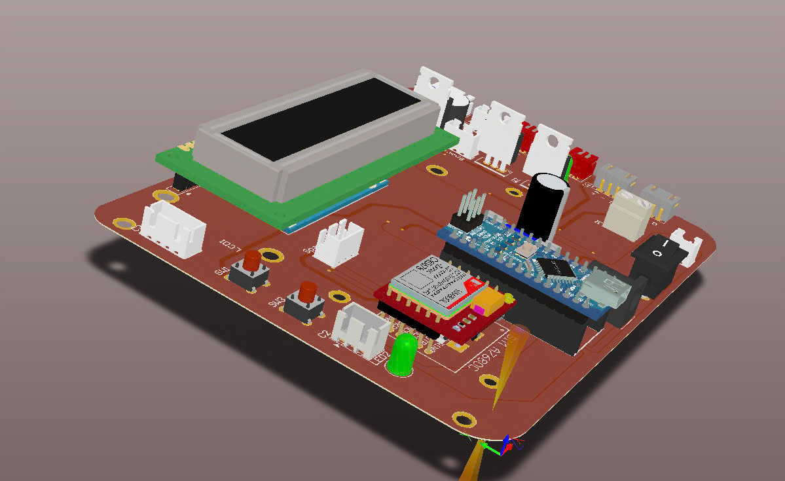

# Hệ Thống Báo Cháy Tự Động với Module SIM

Hệ thống báo cháy tự động sử dụng Arduino Nano với các cảm biến phát hiện nhiệt độ, khí gas, lửa và tích hợp module SIM A7680C để gửi cảnh báo qua tin nhắn/cuộc gọi điện thoại.

## Tính năng

- **Phát hiện khí gas**: Sử dụng cảm biến MQ2, khi phát hiện nồng độ khí gas vượt ngưỡng, hệ thống sẽ:
  - Bật quạt thông gió
  - Kích hoạt còi báo động
  - Hiển thị cảnh báo trên màn hình LCD
  - Gửi thông báo SMS đến số điện thoại đã cài đặt

- **Phát hiện lửa và nhiệt độ cao**: Sử dụng cảm biến lửa và cảm biến nhiệt độ DS18B20, khi phát hiện lửa hoặc nhiệt độ cao vượt ngưỡng, hệ thống sẽ:
  - Kích hoạt máy bơm nước dập lửa
  - Ngắt nguồn điện tổng thông qua relay
  - Kích hoạt còi báo động
  - Hiển thị cảnh báo trên màn hình LCD
  - Gửi SMS và thực hiện cuộc gọi đến số điện thoại đã cài đặt

- **Hai chế độ hoạt động**:
  - **Chế độ tự động**: Hệ thống tự động phát hiện và phản ứng với các tình huống khẩn cấp
  - **Chế độ thủ công**: Người dùng có thể điều khiển quạt và máy bơm bằng các nút nhấn

- **Cảnh báo từ xa**:
  - Gửi SMS thông báo khi phát hiện sự cố
  - Thực hiện cuộc gọi báo động
  - Cấu hình số điện thoại nhận thông báo qua SMS

## Phần cứng

- **Vi điều khiển**: Arduino Nano
- **Cảm biến**:
  - Cảm biến khí gas MQ2
  - Cảm biến lửa
  - Cảm biến nhiệt độ DS18B20
- **Thiết bị đầu ra**:
  - Màn hình LCD 16x2 với giao tiếp I2C
  - Còi báo động
  - LED báo hiệu
  - Relay điều khiển nguồn điện
  - Quạt thông gió
  - Máy bơm nước
- **Truyền thông**: Module SIM A7680C

## Cấu trúc mã nguồn

- **Thư viện sử dụng**:
  - OneWire: Giao tiếp với cảm biến DS18B20
  - DallasTemperature: Đọc dữ liệu nhiệt độ từ DS18B20
  - Wire: Giao tiếp I2C với LCD
  - LiquidCrystal_I2C: Điều khiển màn hình LCD
  - SoftwareSerial: Giao tiếp với module SIM
  - EEPROM: Lưu trữ số điện thoại

- **Chức năng chính**:
  - Quản lý các cảm biến
  - Hiển thị trạng thái trên LCD
  - Điều khiển thiết bị đầu ra
  - Gửi SMS và thực hiện cuộc gọi thông qua module SIM
  - Chuyển đổi giữa chế độ tự động và thủ công

## Cài đặt

1. Tải mã nguồn từ GitHub
2. Mở file `FireAlarmSystem.ino` trong Arduino IDE
3. Cài đặt các thư viện cần thiết
4. Kết nối phần cứng theo sơ đồ
5. Nạp mã nguồn vào Arduino Nano

## Sử dụng

- **Cấu hình số điện thoại nhận thông báo**:
  - Gửi tin nhắn đến SIM trong mạch với cú pháp: `SDT0123456789` (thay bằng số điện thoại thực)

- **Chuyển đổi chế độ hoạt động**:
  - Nhấn và giữ nút SW1 trong 3 giây để chuyển đổi giữa chế độ tự động và thủ công

- **Chế độ thủ công**:
  - Nhấn SW1 để bật/tắt quạt
  - Nhấn SW2 để bật/tắt máy bơm

## Thiết kế mạch

Mạch được thiết kế bằng phần mềm Altium Designer, bao gồm:
- Mạch nguồn với bộ chuyển đổi LM2596
- Mạch điều khiển dựa trên Arduino Nano
- Module SIM A7680C để gửi tin nhắn và thực hiện cuộc gọi
- Các mạch kết nối với cảm biến và thiết bị đầu ra

## Tài liệu tham khảo

- [Video demo hệ thống báo cháy tự động](https://www.youtube.com/watch?v=evE8AJIoJZU)

## Giấy phép

MIT License

## Tác giả

Trần Phương Nam  
Email: tranphuongnam292003@gmail.com 